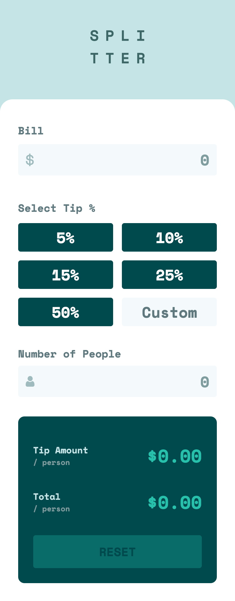
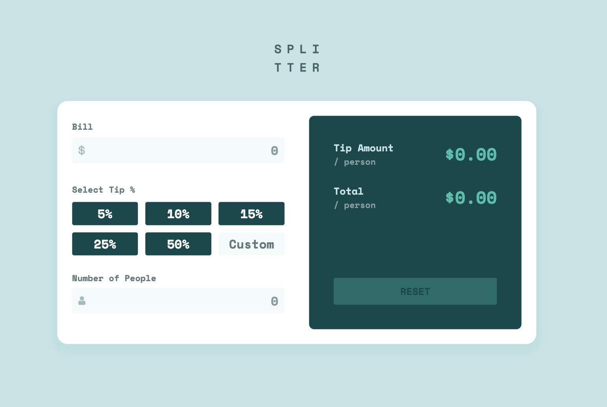

# Frontend Mentor - Tip calculator app solution

This is a solution to the [Tip calculator app challenge on Frontend Mentor](https://www.frontendmentor.io/challenges/tip-calculator-app-ugJNGbJUX). Frontend Mentor challenges help you improve your coding skills by building realistic projects.

## Table of contents

- [Overview](#overview)
  - [The challenge](#the-challenge)
  - [Screenshot](#screenshot)
  - [Links](#links)
- [My process](#my-process)
  - [Built with](#built-with)
  - [What I learned](#what-i-learned)
  - [Continued development](#continued-development)

## Overview

### The challenge

Users should be able to:

- View the optimal layout for the app depending on their device's screen size
- See hover states for all interactive elements on the page
- Calculate the correct tip and total cost of the bill per person

### Screenshot




### Links

- Solution URL: [GitHub](https://github.com/Ayako-Yokoe/tip-calculator-app-main)
- Live Site URL: [Vercel](https://tip-calculator-app-seven-swart.vercel.app/)

## My process

### Built with

- Semantic HTML5 markup
- CSS custom properties
- Flexbox
- CSS Grid
- Mobile-first workflow

### What I learned

I learned a lot from working on this project.
It was challenging to implement the custom tip section, where initially a button is displayed, and when the button is clicked, it switches to an input field for the user to enter a custom tip amount.
Additionally, validating input numbers, such as decimals and limiting numbers starting with 0s, was another challenge.

```html
<li id="custom">
  <button class="custom-btn" id="custom-btn">Custom</button>

  <input
    class="custom-input"
    id="custom-input"
    type="number"
    placeholder="0"
    style="display: none; width: 100%"
  />
</li>
```

```js
customBtn.addEventListener("click", (e) => {
  tip = parseInt(e.target.getAttribute("data-tip"), 10)
  updateCalculations(billAmount, tip, numOfPeople)

  customInput.style.display = "inline-block"
  customInput.focus()
  customBtn.style.display = "none"

  customInput.addEventListener("input", (e) => {
    e.target.value = e.target.value.replace(/^0+/, "")

    if (e.target.value === "" || isNaN(Number(e.target.value))) {
      tip = 0
    } else {
      tip = Number(e.target.value)
    }

    let validBillAmount = billAmount || 0
    let validNumOfPeople = numOfPeople || 1

    updateCalculations(validBillAmount, tip, validNumOfPeople)
  })

  enableReset()
})
```

### Continued development

As part of the purpose of this project, I focused on refactoring functions. I will continue learning how to make the code more readable.

# tip-calculator-app-main
